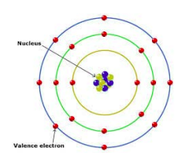
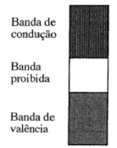

# Campo elétrico

Define-se o campo elétrico como sendo a força exercida
numa carga elétrica pontual q, colocada nesse ponto, por unidade de
carga elétrica:

$$
\overrightarrow{E} = \frac{\overrightarrow{F_E}}{q}
$$

A carga elétrica é, tal como a massa, uma propriedade
da matéria. Um corpo pode ter carga positiva, negativa
ou neutra.

Unidade:
- C, Coulomb;

## Força de Coulomb

A força de Coulomb é a força que atrai ou repele duas cargas.

Dada por:

$$
 \overrightarrow{F} = \frac{1}{4\pi \epsilon} \frac{q_1 q_2}{d^2} \overrightarrow{u_r}
 $$

$$\epsilon$$, permititividade elétrica.

Duas cargas __atraem-se quando têm sinais diferentes__ e __repulsam-se quando
têm sinais iguais.__

# Condução em sólidos, líquidos e gases

## Sólidos

Um eletrão de um átomo pode estar apenas num nível de energia.  
Estes "níveis" de energia são bandas de energia, umas proibidas e 
outras permitidas.

A última banda em que eletrões podem estar sem se libertarem de um átomo 
chama-se __banda de valência__, (são os eletrões dessa banda que podem ser 
trocados ou partilhados com outros átomos).

## Bandas de energia

Acima da banda de valência existe a __banda de condução__, uma banda permitida 
em que os eletrões estão tão fracamente ligados ao átomo que são considerados 
__átomos livres__.

Para haver transferência entre bandas é necessária energia térmica:
- A 0 Kelvin não existem eletrões na banda de condução.
- Os eletrões não ficam tempo significativo na banda proibida.

### Diferentes tipos de bandas de energia

__Isoladores__:
- A banda proibida é muito larga, ou seja não haverá corrente elétrica a 
temperaturas baixas.

__Metais__:
- A banda proibida é estreita ou inexistente.

__Semi-condutores__:
- Banda proibida relativamente estreita.
- A baixa temperatura comportam-se como __Isoladores__.
- Quando aquecidos comportam-se como __condutores__.
