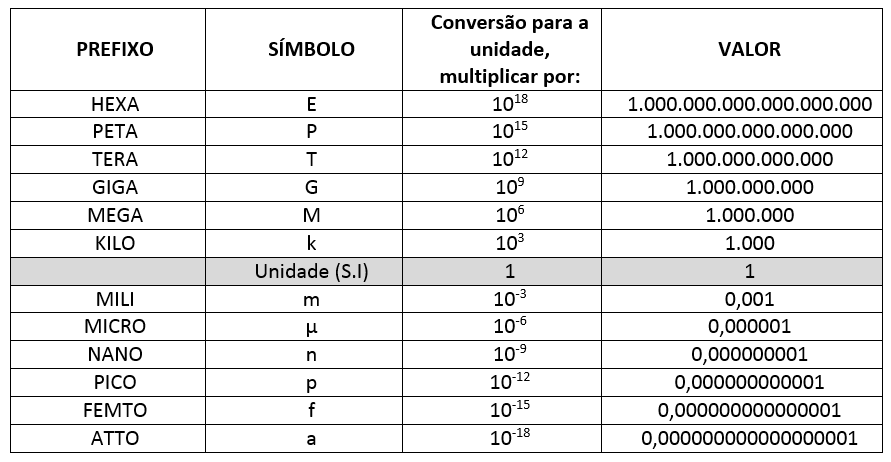
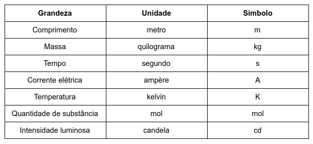
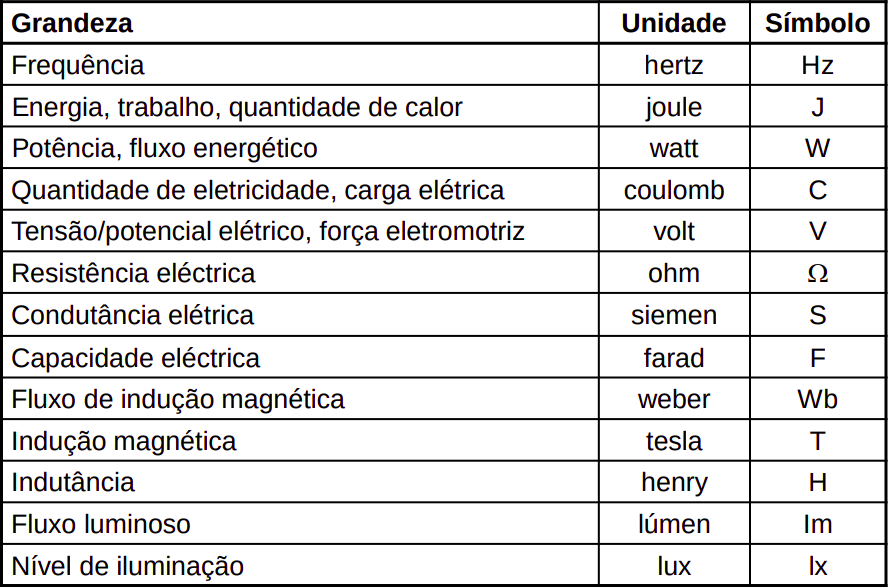

---

## Informações sobre curso
### Professor:
+ jmb@staff.uma.pt

### Frequências:
- 30/11/2021, 16:30;
- 25/1/2022, 15:00;

---

## Lista de aulas

1. [Campo, corrente, carga elética](aula1)
1. [Grandezas elétricas](aula2)

## Sistema internacional

