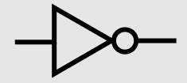
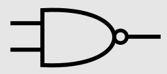
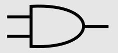
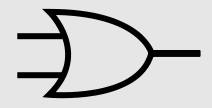
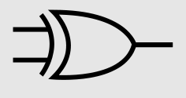

# Funções Lógicas

Funçõe lógicas são funções que podem assumir apenas verdadeiro ou falso. Pois
estas são constituídas por variáveis lógicas que tomam o valor de __0 ou 1__.

## Tipos de portas lógicas

Para __representar__ estas funções lógicas são usados:
- Circuitos elétricos;
- Tabelas de verdade;
- Algebra booleana.

### __Identidade__

A __funcão identidade__ é uma funcão especial em que o input é __igual__ ao input.

Representação __algébrica__:

$$I(x) = x$$

Representação em __tabela de verdade__:

Var $$a$$ | $$F(a)$$
:-:|:-:
 1 | 1 
 0 | 0 

---

### __Negação/NOT__

Negação é uma porta lógica que __nega/inverte__ o sinal dado.

Exemplo sendo $$a$$ o input da funcão:

Representação __algébrica__:

$$F(a) = \bar{a}$$

Representação em __circuito__:

Representação em __tabela de verdade__:

Var $$a$$ | $$F(a)$$
:-:|:-:
 1 | 0 
 0 | 1 

E __qualquer porta lógica pode ser negada pondo um círculo à frente da porta__.  
Exemplo:

---

### __E/AND__

__AND__ é uma porta lógica que __retorna verdadeiro apenas se ambas as 
variáveis forem verdadeiras__.

Representação __algébrica__:

$$F(a,b) = a . b$$

Representação em __circuito__:

Representação em __tabela de verdade__:

Var $$a$$ | Var $$b$$ | $$a \text{ AND } b$$
:-:|:-:|:-:
 0 | 0 | 0 
 0 | 1 | 0 
 1 | 0 | 0 
 1 | 1 | 1 

---

### __Ou/OR__

__OR__ é uma porta lógica que __retorna verdadeiro se qualquer uma das 
variáveis for verdadeira__.

Representação __algébrica__:

$$F(a,b) = a + b$$

Representação em __circuito__:

Representação em __tabela de verdade__:

Var $$a$$ | Var $$b$$ | $$a \text{ OR } b$$
:-:|:-:|:-:
 0 | 0 | 0 
 0 | 1 | 1 
 1 | 0 | 1 
 1 | 1 | 1 

---

### XOR

__XOR__ ou __OU exclusivo__ é uma função que retorna verdadeiro se __e só__ uma
das variáveis for verdadeira.  
Exemplo: "Eu vou levar a gabardine OU o guarda chuva."  

Representação __algébrica__:

$$F(a,b) = a\oplus b$$

Representação em __circuito__:

Representação em __tabela de verdade__:

Var $$a$$ | Var $$b$$ | $$a \oplus b$$
:-:|:-:|:-:
 0 | 0 | 0 
 0 | 1 | 1 
 1 | 0 | 1 
 1 | 1 | 0 

## Comutatividade e Associatividade

### Negação/NOT
### E/AND

A função AND é __associativa e comutativa__:

$$ A . B = B . A$$

$$ (A.B) . C = A . (B.C) $$

### Ou/OR

A função OR é __associativa e comutativa__:

$$ A + B = B + A$$

$$ (A+B) + C = A + (B+C) $$

### XOR/OU exclusivo

A função XOR é __associativa e comutativa__:

$$ A \oplus  B = B \oplus  A$$

$$ (A\oplus B) \oplus  C = A \oplus  (B\oplus C) $$

### E negado, OU negado

Ambas as funções são __associativas__:

$$ \bar{A+B} = \bar{B+A} $$

$$ \bar{A.B} = \bar{B.A} $$

Mas nenhuma é __comutativa__:

$$ \overline{\overline{A+B}+C} \neq \overline{A+ \overline{B+C}} $$

$$ \overline{\overline{A.B}.C} \neq \overline{A. \overline{B.C}} $$

## Teoremas

Existem vários teoremas que nos permitem simplificar funções lógicas.  
Estes teoremas usam apenas as operações de __E, OU, NOT__

### Princípio da dualidade

Este princípio diz-nos que é possível obter o __dual__ de uma expressão 
__trocando__ (trocar E com OU e vice-versa) todas as operações e __negando__
todos os valores lógicos.  
Exemplo:

$$\overline{A+B} = \overline{A.B} $$

### Equações base

Estao equações são casos simples fundamentais da algebra de boole:

$$A+0=A \qquad  A.1=A$$

$$A+1=1 \qquad  A.0=0$$

$$A+A=A \qquad  A.A=A$$

$$A+\overline{A}=1 \qquad  A.\overline{A}=0$$

### Lista de Teoremas

$$A+AB \qquad A(A+B)=A$$

$$AB+A\overline{B}=A \qquad (A+B)(A+\overline{B}=A$$

$$A+\bar{A}B = A+B \qquad A(\bar{A}+B)=AB$$

$$A+(BC)=(A+B)(A+C) \qquad A(B+C)=AB+AC$$

$$AB+\bar{A}C=(A+C)(\bar{A}+B) \qquad (A+B)(\bar{A}+C)=AC+\bar{A}B$$

$$AB+\bar{A}C+BC=AB+\bar{A}C \qquad (A+B)(\bar{A}+C)(B+C)=(A+B)(\bar{A}+C)$$

Por fim o __teorema de Morgan__.

$$\overline{A+B+C+...} = \bar{A} . \bar{B} . \bar{C} . \bar{...}$$

$$\overline{A.B.C. \; ...} = \bar{A} + \bar{B} + \bar{C} + \overline{...}$$

## Forma canónica de funções

As founções lógicas são representadas por __somas de produtos__ e __produtos 
de somas__, para representar uma função em forma canónica é necessário estar 
não só em produtos de somas ou somas de produtos, mas é também necessário todos
os termos da função incluírem todas as variáveis.
